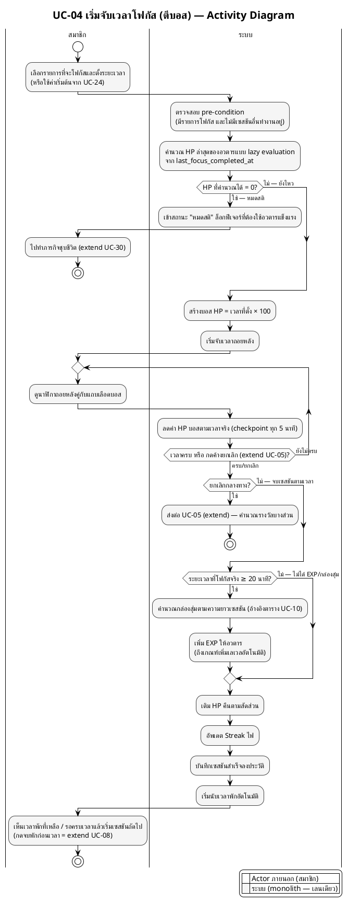

# ตัวอย่าง — Activity Diagram ที่ทำตามกฎครบทุกข้อ (สถาปัตยกรรม Monolith)

> ตัวอย่างนี้ใช้ **UC-04 · เริ่มจับเวลาโฟกัส (ตีบอส)** จากโปรเจกต์จริง (ดูตาราง use case description ใน `proposal/usecase/usecase_description_2.md`) เพื่อสาธิตกฎทั้งหมดใน [`activity_diagram_generate_guide.md`](../guide/activity_diagram_generate_guide.md)

จุดที่ตัวอย่างนี้สาธิตให้เห็น:
- **ฝั่งซอฟต์แวร์มีเลนเดียวชื่อ "ระบบ"** — ตรวจ pre-condition, คำนวณ HP, สร้างบอส, แจกรางวัล, บันทึกประวัติ ทั้งหมดเกิดในเลนเดียวกัน เพราะเป็น monolith ไม่แยกตาม layer หรือ module (ไม่มีเลน Session Service / Avatar Service / Item Service)
- **ไม่มี Gateway/ตรวจ JWT คั่น** — การล็อกอินเป็น pre-condition ในตาราง use case description ไม่ต้องวาดซ้ำ
- **ไม่มี Audit Log / Notification Service แยก** — "บันทึกเซสชันสำเร็จลงประวัติ" และการแจ้งเตือนช่วงพัก เป็นกิจกรรมปกติในเลนระบบ ไม่ต้อง fork ไป service อื่น
- **Decision ตรงกับ Alternative Flow ในตาราง** — HP = 0 → หมดสติไป UC-30, ยกเลิกกลางทาง → UC-05, โฟกัสไม่ถึง 20 นาที → ไม่ได้ EXP/กล่องสุ่ม
- **Loop ด้วย `repeat`/`repeat while`** — วนแสดงนาฬิกาถอยหลังจนกว่าเวลาครบหรือผู้ใช้กดค้างยกเลิก
- **จุดส่งต่อ use case อื่น (extend) เขียนเป็นกิจกรรม + `stop`** — ไม่ต้องวาด flow ของ UC-05/UC-30 ต่อในไดอะแกรมนี้ เพราะแต่ละ use case มีไดอะแกรมของตัวเอง
- **Monochrome ล้วน** — ไม่มี partition ไหนใช้สีต่างจากที่อื่น

---

---

## เทียบกับตาราง Use Case Description ของ UC-04

| องค์ประกอบในไดอะแกรม | มาจากส่วนไหนของตาราง |
|---|---|
| กิจกรรมแรกของสมาชิก (เลือกรายการ + ตั้งเวลา) | Basic Flow ข้อ 1 |
| ตรวจ pre-condition + คำนวณ HP lazy | Pre-condition + Basic Flow ข้อ 2 |
| กิ่ง HP = 0 → หมดสติ → UC-30 | Alternative/Exception Flow + Business Rules (HP decay) |
| สร้างบอส HP = นาที × 100 | Basic Flow ข้อ 3 + Business Rules (อัตราแปลงเวลา) |
| Loop นับถอยหลัง + checkpoint | Basic Flow ข้อ 4 |
| กิ่งยกเลิกกลางทาง → UC-05 | Alternative Flow + ความสัมพันธ์ `<<extend>>` |
| กิ่ง ≥ 20 นาที → EXP/กล่องสุ่ม | Basic Flow ข้อ 5 + Business Rules (เกณฑ์ 20 นาที) |
| เติม HP / streak / บันทึกประวัติ / เริ่มพัก | Basic Flow ข้อ 5-7 + Post-condition |
| จบพักก่อนเวลา = UC-08 | ความสัมพันธ์ `<<extend>>` |

> **ข้อสังเกต:** ทุก decision และกิ่งทางเลือกในไดอะแกรมต้องชี้กลับไปหาแถวใดแถวหนึ่งในตารางได้เสมอ — ถ้ามีกิ่งที่ตารางไม่ได้พูดถึง แปลว่าตารางตกหล่น หรือไดอะแกรมแต่งเติมเกินสเปก อย่างใดอย่างหนึ่งต้องแก้
