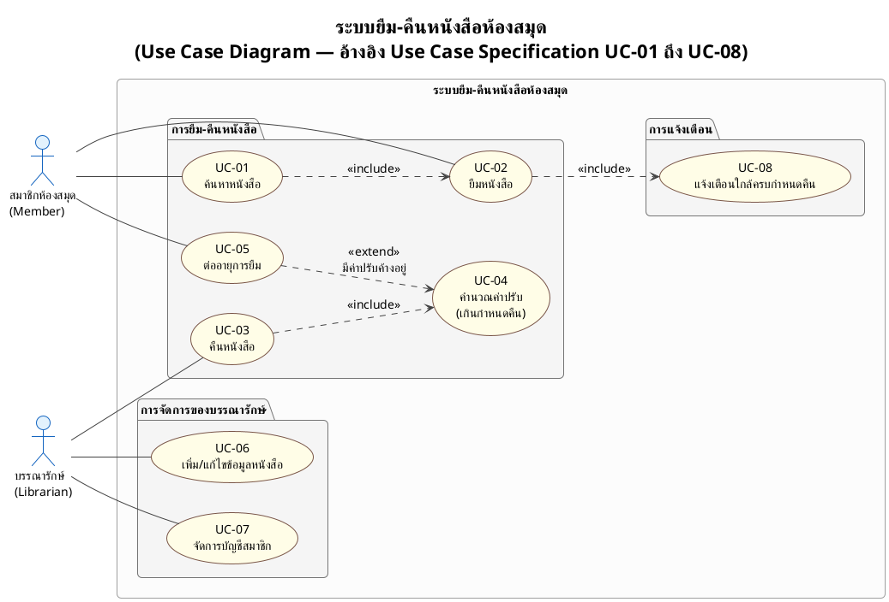
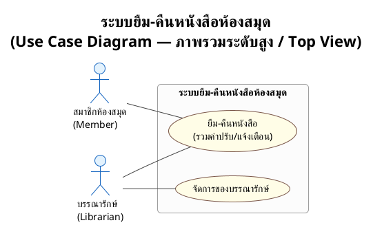

# ตัวอย่าง — Use Case Diagram ที่ทำตามกฎครบทุกข้อ

> ตัวอย่างนี้ใช้ระบบสมมติ **"ระบบยืม-คืนหนังสือห้องสมุด"** เพื่อสาธิตกฎทั้งหมดใน [`usecase_generate_guide.md`](../guide/usecase_generate_guide.md) — ไม่ผูกกับโครงงานใดโครงงานหนึ่งโดยเฉพาะ ใช้เป็นตัวอย่างอ้างอิงได้กับทุกโปรเจกต์

จุดที่ตัวอย่างนี้สาธิตให้เห็น:
- **ไม่มี actor "ระบบ"** — พฤติกรรมอัตโนมัติ (คิดค่าปรับ, แจ้งเตือนใกล้ครบกำหนด) ผูกเข้ากับ use case ของ Member ผ่าน `<<include>>`/`<<extend>>` แทน
- **เส้น actor–use case เป็นเส้นธรรมดา** (`--`) ไม่ใช้ลูกศร
- **ทิศทาง `<<include>>`/`<<extend>>` ถูกต้อง** ตามกฎข้อ 2 ของไกด์
- **จัดกลุ่มด้วย package** และมีทั้งฉบับละเอียด + ฉบับภาพรวม (Top View)
- **ไม่มี note** ในทั้งสองไดอะแกรม

---

## ฉบับละเอียด

**อธิบายจุดที่มักผิด (เทียบกับ diagram ผิดแบบเดิม):**
- UC-04 (คำนวณค่าปรับ) และ UC-08 (แจ้งเตือน) เป็นพฤติกรรมอัตโนมัติที่ **ไม่มี actor ริเริ่มตรง ๆ** — ถ้าทำผิดจะไปสร้าง `actor "System"` แล้วลาก `System --> UC04` และ `System --> UC08` ซึ่งผิดหลัก UML ในตัวอย่างนี้จึงผูก UC-04 เข้ากับ UC-03 (คืนหนังสือ, `<<include>>` เพราะคำนวณทุกครั้งที่คืน) และ UC-05 (`<<extend>>` เพราะเกิดเฉพาะกรณีมีค่าปรับค้าง) ส่วน UC-08 ผูกกับ UC-02 (`<<include>>` เพราะยืมแล้วต้องตั้งการแจ้งเตือนเสมอ)

---

## ฉบับภาพรวม (Top View)

ฉบับภาพรวมยุบ UC-01 ถึง UC-08 (ยกเว้น UC-06, UC-07 ที่แยกไปกลุ่มบรรณารักษ์) เหลือ use case ตัวแทนกลุ่มเดียว — ใช้เปิดพรีเซนต์แล้วสลับไปฉบับละเอียดถ้ากรรมการถามลึกกว่านั้น
