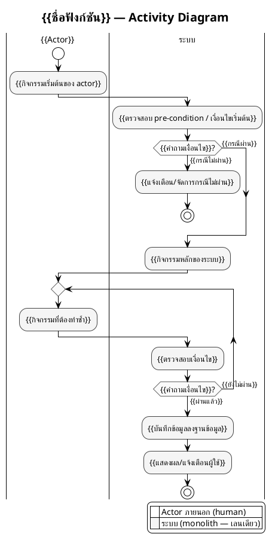

# Template — Activity Diagram แบบมี Swimlane (`.puml`) — สถาปัตยกรรม Monolith

> วิธีใช้: คัดลอกโค้ด PlantUML ด้านล่างไปที่ `<module>/activity_<ชื่อฟังก์ชัน>.puml`
> แทนที่ `{{...}}` ด้วยข้อมูลจริง และลบ/เพิ่ม activity, decision, loop ตามจำนวนจริงของกระบวนการ
> ต้องทำตามกฎใน [`activity_diagram_generate_guide.md`](../guide/activity_diagram_generate_guide.md) ทุกข้อ โดยเฉพาะ **ฝั่งซอฟต์แวร์มีเลนเดียวชื่อ "ระบบ"**, **ไม่มี Gateway/Audit Log/cross-cutting**, และ **ห้ามใช้สีหลายโทน (monochrome เท่านั้น)**
> ดูตัวอย่างที่กรอกครบแล้วได้ที่ [`activity_diagram_example.md`](../example/activity_diagram_example.md)

---

